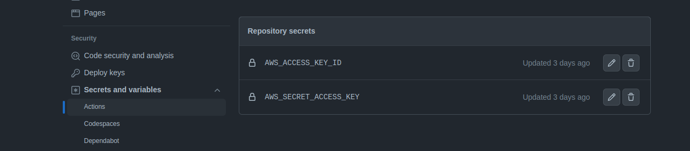
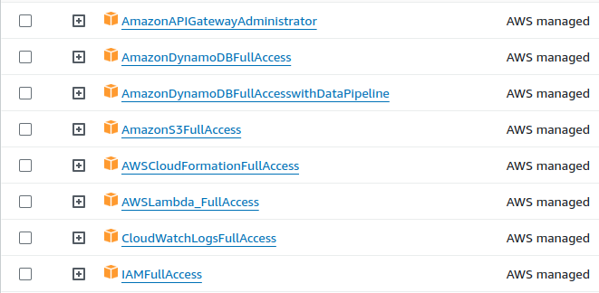
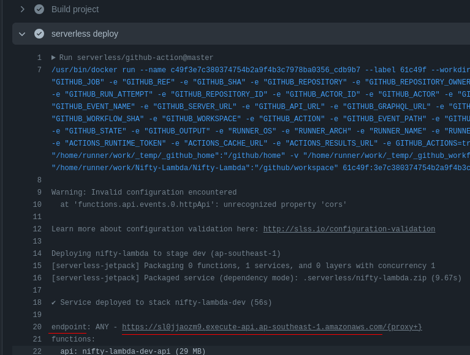
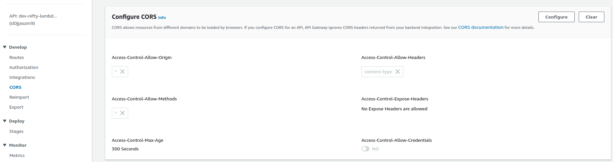
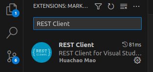

# Simple Web Application with React, Nest.js, AWS Lambda, and DynamoDB

**Objective:** A minimalistic web application with a React front-end and a
Nest.js backend running on AWS Lambda, using DynamoDB for database operations.
The app is capable of doing basic CRUD operations of user data.

**Description**: This project is build using `NestJs` and it's deployed in `AWS Lambda` with the help of `Github Action`, [serverless framework](https://www.serverless.com/) and `Continuous Deployment` strategy. 

1. `Github Action` code: `.github/workflows/main.yml` 

2. `serverless` code: `serverless.yml` in the `root folder`.

**Lambda Function** start point is defined in `src/lambda.ts` file.

# Setup Guide
1. We need to add `AWS Access Key ID` and `AWS Secret Acess Key` to `Github's`.
   
   To do so, go to **github-repo -> Settings -> Secrets and variables**  menu and add `AWS_ACCESS_KEY_ID` and `AWS_SECRECT_ACCESS_KEY` 

   

2. We also need to provide following **IAM permissions** to the AWS user.
   
   

# Deployment
**Github action** will be triggered if anything pushes in `deploy` branch and this will provisioned the total `Lambda Architecture` according to the definition of `serverless.yml` file.

A **DynamoDB** table will be created by the rules defined in `serverless.yml` file.

```yml
.....
  ...
   environment:
     DYNAMODB_TABLE_NAME: ${self:custom.usersTableName}

custom:
  usersTableName: users-table-${self:provider.stage}
.....
```
As we `deployed` the **system** in `dev` environment, our table name would be `users-table-dev`.

Also the `API Gateway` will be created and an **API Endpoint** will be provided after **Github Action** finished. 

**Go To**: `<repo menu> -> Actions -> <latest-commit>`

**API Gateway Endpoint**:



Finally need to enable **CORS** in `API Gateway Endpoint` in **AWS**. 



# APIs
All the APIs are listed in `requests.http` file in the `root folder`.

API calls can be performed from `VS Code` if `REST Client` **Extension** is installed.



# Frontend
**Frontend repo**: https://github.com/imrulkk89/nifty-frontend

**Frontend URL**: https://imrulkk89.github.io/nifty-frontend